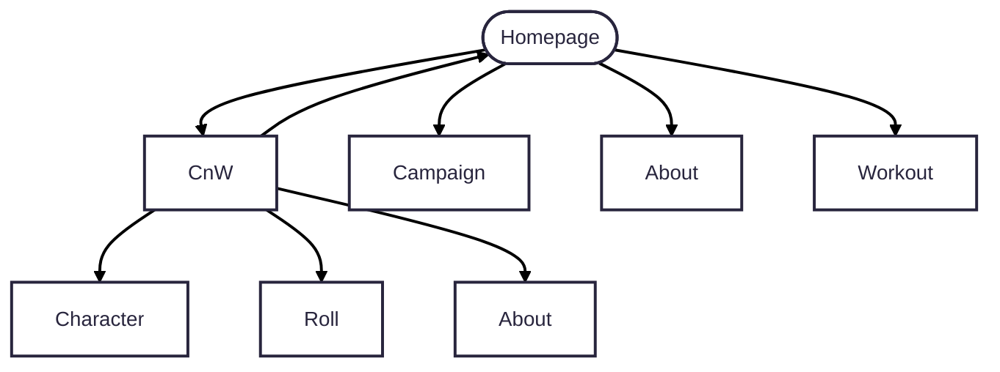

# homepage

```mermaid
---
config:
  theme: redux
---
flowchart TD
    A(["Homepage"]) --> n1["CnW"] & n2["Campaign"] & n3["About"] & n7["Workout"]
    n1 --> n4["Character"] & n5["Roll"] & n6["About"]
    n1 --> A

```
